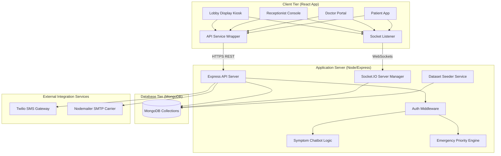

# 🏥 QueueCure-AI

An AI-Powered Hospital Queue Management, Patient Triage, and Real-Time Kiosk System designed to optimize medical consult routing, prioritize emergency patients, and reduce waiting-room anxiety.

---

## 📸 Screenshots & UI Mockups

Here are premium visual mockups of the QueueCure-AI interface (saved in the workspace system):

### 1. Interactive Queue Dashboard & Analytics


### 2. AI Triage & Chatbot Widget


*(Note: These high-fidelity design mockups can be found under the agent's application data folder, ready to copy to your submission materials.)*

---

## 📖 Overview

QueueCure-AI is a comprehensive hospital workflow solution. Standard hospital lobbies operate on a strict First-In-First-Out (FIFO) waiting list, which fails to accommodate critical medical priority levels and leaves patient status opaque. 

QueueCure-AI solves this by:
1. **Dynamic Priority-Weighted Queuing**: Moves patients up or down the waiting list based on triage urgency.
2. **Emergency Fast-Track Overrides**: Instantly routes critical cases to position #1, shifting downstream timelines.
3. **AI Triage Symptom Matching**: Automatically maps patient complaints to specialties and recommends doctors.
4. **Real-Time Synchronized Displays**: Public digital kiosks update instantly when called by a doctor.

---

## ✨ Features

- **Real-Time Public Lobby (`/queue`)**: No auth required kiosk displaying clock, active token called, waiting patients, and live status.
- **Receptionist Console**: Quick patient check-in form with priority selectors and instant token creation.
- **Practitioner Consultation cabins**: Allows doctors to click "Call Next", ending the active consultation and calling the next priority patient.
- **Emergency Priority Engine**: Insertion utility that shifts any patient to the top of the queue.
- **Analytics & Leaderboard**: SVG graphs rendering patient volumes, wait distributions, and doctor consult rates.
- **Account Profiles & Settings**: Role-customized data forms (e.g., medical history for patients, specialties for doctors) and notification toggles.
- **Auto-Generating Seeders**: Generates extensive pre-populated CSV data for testing.

---

## 💻 Tech Stack

### Frontend
- **React.js & Vite**: Fast SPA compilation.
- **Tailwind CSS v4**: Modern, premium dark-theme styling using glassmorphism.
- **Dependency-Free Navigation**: History state routing system for zero-overhead guarding.
- **WebSockets (Socket.IO CDN)**: Handles real-time lobby synchronization.

### Backend
- **Node.js & Express.js**: REST API server.
- **MongoDB & Mongoose**: Database models for Users, Patients, Doctors, Hospitals, Appointments, and Queues.
- **Socket.IO**: Real-time server communication.
- **Nodemailer & Twilio**: Dispatches SMS alerts and email reminders.

---

## 🏗️ Architecture Diagram

This flowchart outlines the real-time data synchronization between the clients, server, database, and notification nodes:



---

## ⚙️ Installation & Running

### Prerequisites
- Node.js (v18+)
- MongoDB running locally (`mongodb://127.0.0.1:27017/queuecure`)

### 1. Configure Env Variables

#### Backend (`backend/.env`):
```env
PORT=5000
MONGODB_URI=mongodb://127.0.0.1:27017/queuecure
JWT_SECRET=queuecure_ai_secret_2026
NODE_ENV=development
```

#### Frontend (`frontend/.env`):
```env
VITE_API_URL=http://localhost:5000
```

### 2. Generate Synthetic Datasets & Start Backend
To initialize and populate the 5 CSV datasets (1,000 patients, 100 doctors, 25 hospitals, 5,000 appointments, and 2,000 queues), run:
```bash
# From project root
python scripts/generate_datasets.py
# OR
node scripts/generate_datasets.js
```
Then start the backend server:
```bash
cd backend
npm install
npm run dev
```
*(Default Admin credentials created on startup: `admin@queuecure.com` / `admin123`)*

### 3. Start Frontend
```bash
cd frontend
npm install
npm run dev
```

---

## 📑 API Documentation Reference

All requests must supply the header `"Authorization": "Bearer <JWT_TOKEN>"` except Auth routes.

| HTTP Method | Route Endpoint | Access Role | Description |
|---|---|---|---|
| **POST** | `/api/auth/register` | Public | Register new credentials |
| **POST** | `/api/auth/login` | Public | Sign in and retrieve JWT token |
| **GET** | `/api/queue` | Authenticated | Fetch list of all queue tickets |
| **GET** | `/api/queue/current` | Authenticated | Retrieve active consultation token |
| **GET** | `/api/queue/waiting` | Authenticated | List all waiting patients in lobby |
| **POST** | `/api/queue/next` | Staff / Admin | Call next priority patient into cabin |
| **POST** | `/api/emergency/fast-track`| Staff / Admin | Bypass queue, inserting patient at Pos #1 |
| **GET** | `/api/emergency/critical` | Authenticated | List active emergency tickets |
| **GET** | `/api/analytics/metrics` | Doctor / Admin | Aggregated counters and KPIs |
| **GET** | `/api/analytics/queue-stats` | Doctor / Admin | Status and priority calculations |
| **POST** | `/api/chatbot/message` | Public | Parse symptoms and map to specialties |
| **GET** | `/api/admin/metrics` | Admin | Server diagnostics (CPU/Memory/Uptime) |
| **GET** | `/api/admin/users` | Admin | List registered user directory |
| **PUT** | `/api/admin/users/:id/role`| Admin | Promote or change user security role |
| **PUT** | `/api/admin/users/:id/status`| Admin | Suspend or activate user accounts |
| **DELETE**| `/api/admin/users/:id` | Admin | Permanently remove user credentials |

---

## 🏆 Hackathon PPT Content (Pitch Outline)

### Slide 1: Problem Statement
- **Headline**: The Hospital Lobby Waiting Bottleneck
- **The Issue**: Standard hospital queues operate on rigid First-In-First-Out (FIFO) lines. A patient with severe respiratory trouble stands in the same line behind routine check-ups.
- **Impact**: Delayed emergency responses, high patient anxiety, and receptionist administrative overload.

### Slide 2: The Solution (QueueCure-AI)
- **Headline**: Intelligent Queueing & Real-Time Sync
- **What it does**: Establishes a priority-weighted sorting engine.
- **Triage Check**: Dynamically shifts waiting position indexes.
- **Visual Kiosk**: Public lobby displays update instantly using Socket.io protocols.
- **AI Guidance**: A chatbot maps incoming complaints to appropriate clinics.

### Slide 3: System Architecture
- decoupled React SPA styled with Tailwind CSS v4.
- Express API server handling MongoDB operations and WebSockets.
- Nodemailer SMTP and Twilio SMS dispatchers syncing offline status.

### Slide 4: Hackathon Demo Flow
1. **Lobby Launch**: Open the public display screen (`/queue`).
2. **Receptionist Entry**: Check in a patient (normal priority). They show up at index 1.
3. **Emergency Override**: Fast-track a critical patient. They instantly jump to index 1, shifting the previous patient down.
4. **Doctor Call**: The Doctor dashboard triggers `Call Next`. The lobby kiosk flashes the new token called.
5. **Analytics Review**: View the live charts to monitor average wait times.

---

## 🔮 Future Scope

- **Speech-to-Text Triage**: Allow walk-in patients to speak their symptoms to the lobby kiosk.
- **Biometric Check-In**: Enable facial recognition to retrieve medical cards instantly.
- **Generative AI Diagnostics**: Incorporate LLMs to summarize patient histories for doctors before they enter the consultation room.
