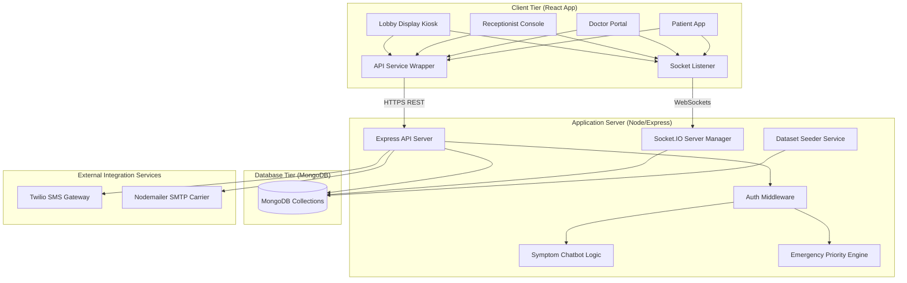
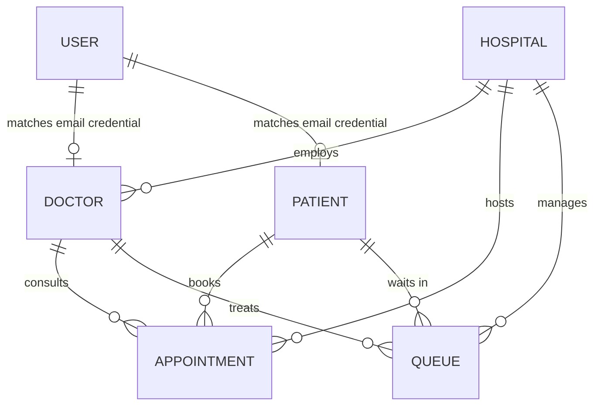

# QueueCure-AI System Architecture

This document describes the high-level system architecture, client-server relationship, database schemas, and data flow patterns implemented in **QueueCure-AI**.

---

## 1. System Topology

QueueCure-AI follows a decoupled client-server architecture consisting of a React-based client layer and a Node/Express backend layer linked to a MongoDB instance. Real-time notifications and queue status updates are handled via Socket.io channels.

---

## 2. Queue Lifecycle & Routing Engine Flowchart

The workflow of token creation, prioritizing, and practitioner consultation runs in a deterministic sequence:

```mermaid
sequenceDiagram
    autonumber
    actor Patient
    actor Receptionist
    actor Doctor
    participant System as QueueCure Server
    participant DB as MongoDB
    participant Socket as Socket.IO Hub

    Patient->>System: Walk-in / Digital Check-in
    System->>DB: Create Patient Record
    System->>DB: Initialize Queue Ticket (WAITING status)
    System->>Socket: Emit 'patientRegistered'
    Socket-->>Receptionist: Refresh Waiting Table
    
    rect rgb(40, 20, 20)
        Note over Receptionist, System: Emergency Priority Override
        Receptionist->>System: POST /api/emergency/fast-track
        System->>DB: Shift Patient Ticket to Position #1 (EMERGENCY priority)
        System->>Socket: Emit 'queueUpdated'
        Socket-->>Doctor: Alert critical patient insertion
    end

    Doctor->>System: Call Next Patient (POST /api/queue/next)
    System->>DB: Mark current active token as COMPLETED
    System->>DB: Move next high-priority token to CONSULTING status
    System->>Socket: Emit 'currentTokenUpdated' & 'queueUpdated'
    Socket-->>Patient: SMS & Email: "Proceed to Dr. Cabin"
    Socket-->>Lobby: Display Kiosk flashes token #
```

---

## 3. Data Schema Relationships

The database model relationships are detailed below:

- **User**: Authentication credentials. Links to a Practitioner/Doctor profile or Patient profile by credentials email.
- **Hospital**: Medical branches containing locations and capacities.
- **Doctor**: Clinic staff with specializations. Belongs to a Hospital.
- **Patient**: Medical records containing phone numbers and priority levels.
- **Appointment**: Scheduled visits linking a Patient, Doctor, and Hospital.
- **Queue**: Real-time ticker items referencing a Patient, Doctor, and Hospital.

